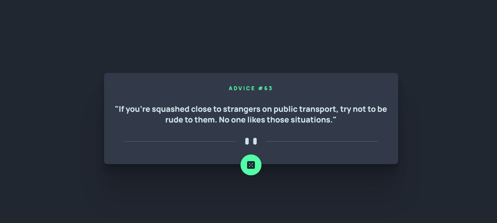

# Advice generator app

This is a solution to the [Advice generator app challenge on Frontend Mentor](https://www.frontendmentor.io/challenges/advice-generator-app-QdUG-13db). Frontend Mentor challenges help you improve your coding skills by building realistic projects.

## Table of contents

- [Overview](#overview)
  - [Screenshot](#screenshot)
  - [Links](#links)
- [My process](#my-process)
  - [Built with](#built-with)
  - [What I learned](#what-i-learned)
  - [Continued development](#continued-development)
  - [Useful resources](#useful-resources)
- [Author](#author)


## Overview


### Screenshot




### Links

- Solution URL: [https://github.com/Jenishkubavat/Advice-generator-app.git](https://github.com/Jenishkubavat/Advice-generator-app.git)
- Live Site URL: [https://jenishkubavat.github.io/Advice-generator-app](https://jenishkubavat.github.io/Advice-generator-app/)

## My process

### Built with

- Semantic HTML5 markup
- CSS custom properties
- Flexbox
- CSS Grid
- [SASS](https://sass-lang.com/) - css preprocessor
- [Gulp](https://gulpjs.com/) - toolkit to automate & enhance your workflow


### What I learned

I get to learn how box shadow and how to add mulitiple shadow to an element as of js part i learn promises and how to fetch data from api.


```html
<h1>Some HTML code I'm proud of</h1>
```
```scss
.advice-container{
    position: relative;
    background-color: map-get($neturals,"Grayish_Blue");
    width:auto;
    max-width: 900px;
    padding:20px 30px;
    border-radius: 10px;
    -webkit-border-radius: 10px;
    -moz-border-radius: 10px;
    -ms-border-radius: 10px;
    -o-border-radius: 10px;

    box-shadow: 0 2.8px 2.2px rgba(0, 0, 0, 0.034), 0 6.7px 5.3px rgba(0, 0, 0, 0.048), 0 12.5px 10px rgba(0, 0, 0, 0.06), 0 22.3px 17.9px rgba(0, 0, 0, 0.072), 0 41.8px 33.4px rgba(0, 0, 0, 0.086), 0 100px 80px rgba(0, 0, 0, 0.12);

    
    display: flex;
    flex-direction: column;
    align-items: center;
    justify-content:center;
    gap: 1.25rem;

}
```
```js
async function getAdvice(){
    const random= Math.floor(Math.random()*200);
    const API_URL= `https://api.adviceslip.com/advice/${random}`;

    try {
         message = await fetch(API_URL).then(response =>{return response.json();})
        adviceId.textContent= message.slip.id;
    if (message.slip.advice.length > 50) {
        advice.classList.add('long');
        advice.classList.remove('advice-text');
    }
    else{
        advice.classList.remove('long');
        advice.classList.add('advice-text');
    }
        advice.textContent = `"${message.slip.advice}"`;
    }
    catch (err) {
    }
}
```


### Continued development
while doing this project i really strugged with layout and reponsiveness of site with mobile ao im look to improve it and make sure i did it properly next time.

### Useful resources

- [flex-box](https://css-tricks.com/snippets/css/a-guide-to-flexbox) - This has nice pitorial representation of flex box and layout whic make easy to learn about flex and its properties
- [box-shadow](https://css-tricks.com/snippets/css/css-box-shadow/) - This is an amazing article which helped me finally understand box shadow. I'd recommend it to anyone still learning this concept.


## Author

- Frontend Mentor - [@Jenishkubavat](https://www.frontendmentor.io/profile/Jenishkubavat)
- Twitter - [@JenishKubavat](https://twitter.com/JenishKubavat)
